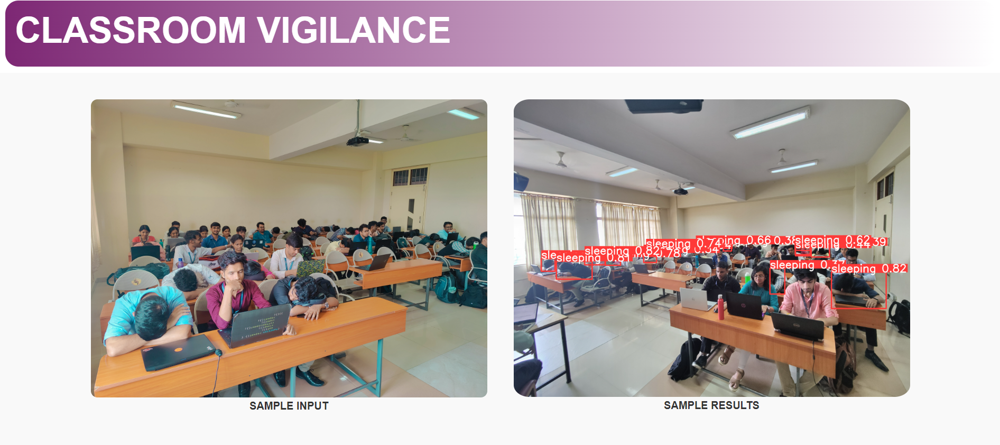
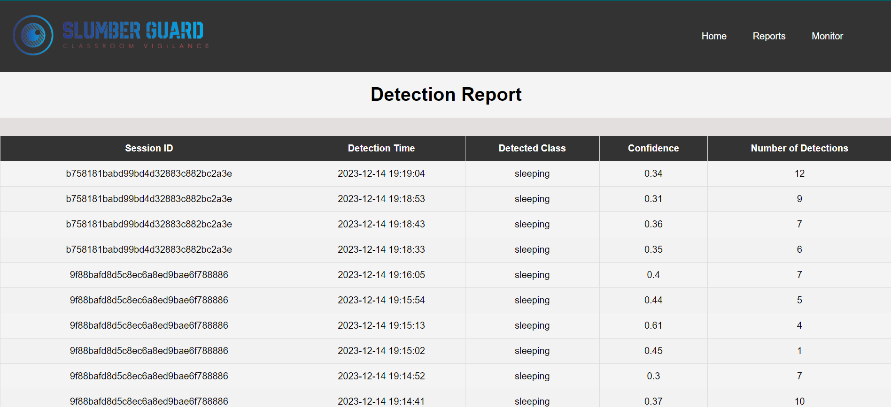
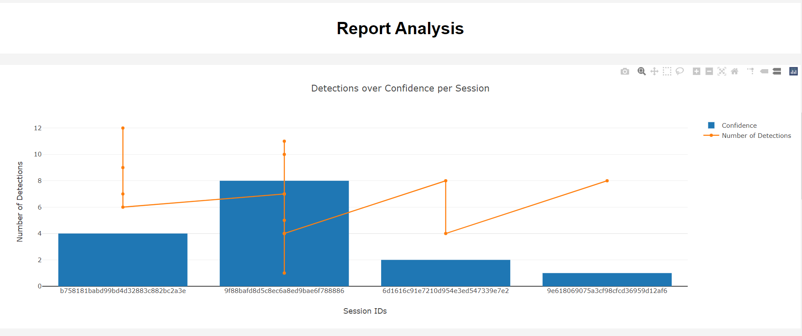
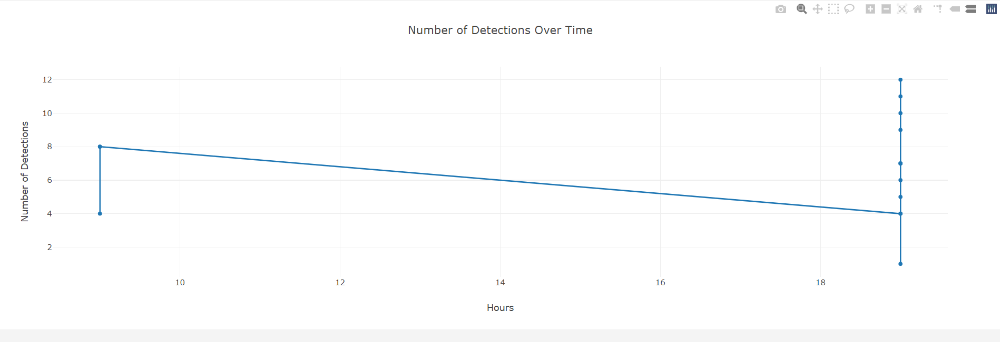

<h1 align="center">~ Classroom Vigilance - Slumber Guard: Drowsiness Detection Web App ~</h1>

  

<h2 align="left">Overview</h2>

  Welcome to Classroom Vigilance - Slumber Guard, where we leverage cutting-edge technology to enhance classroom engagement! Slumber Guard is a web application designed to detect drowsy students during classes, ensuring a more interactive and productive learning environment.

<h3 align="left">Key Features</h3>
<ul>
  <li>Automated Drowsiness Detection: Utilizing computer vision and machine learning, Slumber Guard monitors students for signs of drowsiness in real-time.</li>
  <li>Intelligent Alerts and Suggestions: The system triggers alerts or suggests breaks when signs of drowsiness are detected, promoting healthier learning habits.</li>
  <li>Hourly Reports: Receive detailed reports to gain insights into student engagement patterns, facilitating informed decision-making for educators.</li>
  <li>Promoting Inclusivity: Assist instructors in identifying struggling or fatigued students, enabling personalized teaching approaches.</li>
</ul>
<h3 align="left">Alignment with SDG Goals</h3>

  This project contributes to:
  <ul>
    <li>Quality Education: Fostering an engaging learning environment for all students.</li>
    <li>Sustainable Cities and Communities: Enhancing classroom efficiency and fostering a positive learning atmosphere.</li>
  </ul>

<h3 align="left">Technology Stack</h3>

  Slumber Guard is built with:
  <ul>
    <li>Python</li>
    <li>HTML</li>
    <li>CSS</li>
    <li>OpenCV</li>
    <li>Flask</li>
    <li>Plotly</li>
    <li>JavaScript</li>
  </ul>

<h2 align="left">Getting Started</h2>

  To get started with Slumber Guard, follow these steps:
  <ol>
    <li>Clone the repository: <code>git clone https://github.com/your-username/Classroom-Vigilance-Slumber-Guard.git</code></li>
    <li>Navigate to the project directory</li>
    <li>pip install necessary dependencies</li>
    <li>Run the application: <code>python main.py</code></li>
  </ol>

<h2 align="left">Screenshots</h2>

  
  
  
  

